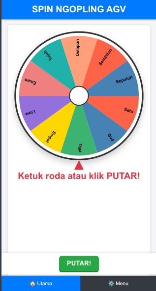
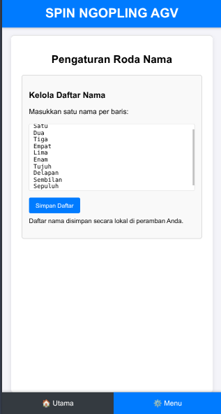

# 🎲 Aplikasi Open Source Spin Nama

## 📝 Deskripsi Proyek

Aplikasi *Open Source* **Spin Nama** ini dirancang khusus untuk membantu masyarakat dalam melakukan pengacakan (spin) nama yang akan dipilih.
Dalam hal ini sih, lagi dipake warga ya hahahah

Proyek ini bersifat *open source* dan **bebas digunakan oleh siapa saja** tanpa batasan.

---

## ✨ Fitur Unggulan

Sertakan poin-poin fitur utama aplikasi Anda di sini.

* Mekanisme acak nama.
* Antarmuka pengguna (User Interface) yang intuitif dan mudah digunakan.
* Dukungan untuk mengelola daftar nama dalam jumlah besar.

---

## 📸 Tampilan Aplikasi

Berikut adalah beberapa tangkapan layar (screenshot) untuk melihat bagaimana aplikasi ini bekerja:

### Layar Utama

### Menu Pilihan

---

## ✨ Cara Pakai 

klik link ini :
[go go go](https://wicky14.github.io/ngopling-agv/)

---

## 🤝 Kontribusi

Kami sangat menghargai kontribusi dari komunitas! Jika Anda ingin berkontribusi, silakan:

1.  *Fork* repositori ini.
2.  Buat *branch* baru: `git checkout -b fitur-baru`
3.  Lakukan perubahan dan *commit* perubahan Anda.
4.  Buat *Pull Request* baru.

## 📜 Lisensi

Proyek ini dilisensikan di bawah [Lisensi MIT].
